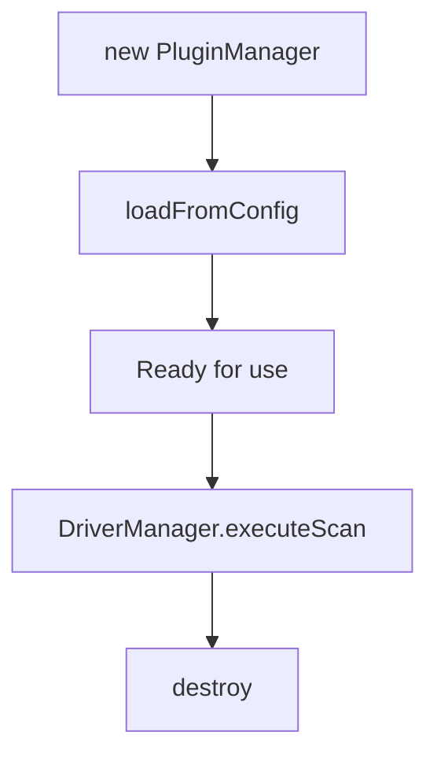
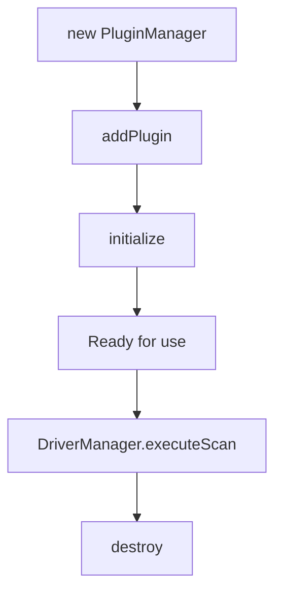

## Overview

The `PluginManager` class handles plugin loading, initialization, and lifecycle management. It maps flat `.vulcn.yml` config to internal plugins automatically.

## Constructor

```typescript
const manager = new PluginManager();
```

## Methods

### loadFromConfig

Load plugins from a flat `VulcnProjectConfig` (from `.vulcn.yml`). This is the primary entry point for the config system.

```typescript
async loadFromConfig(config: VulcnProjectConfig): Promise<void>
```

Maps user-facing config keys to internal plugin configs automatically:

```typescript
import { PluginManager, parseProjectConfig } from "@vulcn/engine";

const config = parseProjectConfig({
  payloads: { types: ["xss", "sqli"] },
  detection: {
    xss: { dialogs: true, severity: "high" },
    reflection: { enabled: true },
    passive: true,
  },
});

const manager = new PluginManager();
await manager.loadFromConfig(config);
// Automatically loads: plugin-payloads, plugin-detect-xss,
// plugin-detect-sqli, plugin-detect-reflection, plugin-passive
```

### addPlugin

Add a plugin programmatically.

```typescript
addPlugin(
  plugin: VulcnPlugin,
  config?: Record<string, unknown>
): void
```

```typescript
import detectXss from "@vulcn/plugin-detect-xss";

manager.addPlugin(detectXss, {
  detectDialogs: true,
  severity: "high",
});
```

### hasPlugin

Check if a plugin is loaded by name.

```typescript
hasPlugin(name: string): boolean
```

```typescript
if (!manager.hasPlugin("@vulcn/plugin-detect-xss")) {
  manager.addPlugin(detectXss);
}
```

### initialize

Initialize all loaded plugins (calls `onInit` hooks).

```typescript
async initialize(): Promise<void>
```

```typescript
await manager.initialize();
// Plugins are now ready
```

### destroy

Destroy all plugins (calls `onDestroy` hooks).

```typescript
async destroy(): Promise<void>
```

```typescript
await manager.destroy();
// Cleanup complete
```

### getPayloads

Get all payloads registered by plugins.

```typescript
getPayloads(): RuntimePayload[]
```

```typescript
const payloads = manager.getPayloads();
console.log(`Loaded ${payloads.length} payload sets`);
```

### addPayloads

Add payloads to the registry.

```typescript
addPayloads(payloads: RuntimePayload[]): void
```

### getFindings

Get all findings collected during execution.

```typescript
getFindings(): Finding[]
```

### addFinding

Add a finding to the collection.

```typescript
addFinding(finding: Finding): void
```

### clearFindings

Clear findings for a new run.

```typescript
clearFindings(): void
```

### getPlugins

Get all loaded plugins.

```typescript
getPlugins(): LoadedPlugin[]
```

### getErrorHandler

Get the error handler for post-run inspection.

```typescript
getErrorHandler(): ErrorHandler
```

## Lifecycle



Or for manual plugin loading:



## Complete Example

```typescript
import {
  DriverManager,
  PluginManager,
  parseProjectConfig,
} from "@vulcn/engine";
import browserDriver from "@vulcn/driver-browser";

async function main() {
  // Register driver
  const drivers = new DriverManager();
  drivers.register(browserDriver);

  // Parse session
  const session = drivers.parseSession(yaml);

  // Load plugins from config
  const manager = new PluginManager();
  const config = parseProjectConfig({
    payloads: { types: ["xss"] },
    detection: { xss: { dialogs: true } },
  });
  await manager.loadFromConfig(config);

  // Execute scan
  const result = await drivers.executeScan([session], manager, {
    headless: true,
  });

  // Get findings
  const findings = manager.getFindings();
  console.log(`Found ${findings.length} vulnerabilities`);

  // Cleanup
  await manager.destroy();
}
```

## Hook Execution

The plugin manager orchestrates hook execution across all loaded plugins:

| Phase              | Hooks Called                         |
| ------------------ | ------------------------------------ |
| **Initialize**     | `onInit` for each plugin             |
| **Record Start**   | `onRecordStart` for each plugin      |
| **Record Step**    | `onRecordStep` (can filter/modify)   |
| **Record End**     | `onRecordEnd`                        |
| **Run Start**      | `onRunStart` for each plugin         |
| **Before Payload** | `onBeforePayload` (can modify)       |
| **After Payload**  | `onAfterPayload` (collect findings)  |
| **Browser Events** | `onDialog`, `onConsoleMessage`, etc. |
| **Run End**        | `onRunEnd`                           |
| **Destroy**        | `onDestroy` for each plugin          |

Hooks are called in the order plugins were added/loaded.

## Hook Variants

The `PluginManager` provides three hook execution patterns:

### callHook

Call a hook on all plugins sequentially (fire-and-forget):

```typescript
await manager.callHook("onRunStart", async (hook, ctx) => {
  await hook(ctx);
});
```

### callHookCollect

Call a hook and collect results from all plugins:

```typescript
const results = await manager.callHookCollect(
  "onAfterPayload",
  async (hook, ctx) => {
    return await hook(responseData, ctx);
  },
);
```

### callHookPipe

Call a hook that transforms a value through the plugin pipeline:

```typescript
const modified = await manager.callHookPipe(
  "onBeforePayload",
  initialPayload,
  async (hook, value, ctx) => {
    return await hook(value, ctx);
  },
);
```
