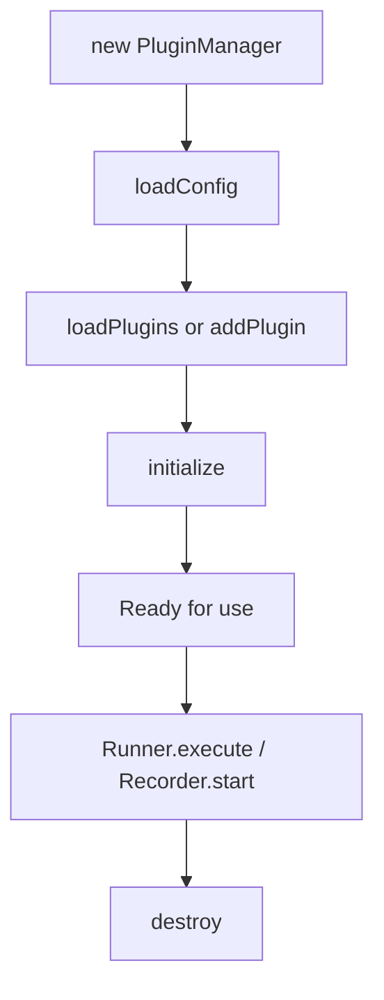

## Overview

The `PluginManager` class handles plugin loading, initialization, and lifecycle management.

## Constructor

```typescript
const manager = new PluginManager();
```

## Methods

### loadConfig

Load configuration from a file.

```typescript
async loadConfig(path?: string): Promise<VulcnConfig>
```

If no path is provided, searches for config files in the current directory.

```typescript
// Auto-detect config file
await manager.loadConfig();

// Specific path
await manager.loadConfig("./vulcn.config.yml");
```

### loadPlugins

Load all plugins defined in the configuration.

```typescript
async loadPlugins(): Promise<void>
```

```typescript
await manager.loadConfig();
await manager.loadPlugins();
```

### addPlugin

Add a plugin programmatically.

```typescript
addPlugin(
  plugin: VulcnPlugin,
  config?: Record<string, unknown>
): void
```

```typescript
import detectXss from "@vulcn/plugin-detect-xss";

manager.addPlugin(detectXss, {
  detectDialogs: true,
  severity: "high",
});
```

### hasPlugin

Check if a plugin is loaded by name.

```typescript
hasPlugin(name: string): boolean
```

```typescript
if (!manager.hasPlugin("@vulcn/plugin-detect-xss")) {
  manager.addPlugin(detectXss);
}
```

### initialize

Initialize all loaded plugins (calls `onInit` hooks).

```typescript
async initialize(): Promise<void>
```

```typescript
await manager.initialize();
// Plugins are now ready
```

### destroy

Destroy all plugins (calls `onDestroy` hooks).

```typescript
async destroy(): Promise<void>
```

```typescript
await manager.destroy();
// Cleanup complete
```

### getPayloads

Get all payloads registered by plugins.

```typescript
getPayloads(): RuntimePayload[]
```

```typescript
const payloads = manager.getPayloads();
console.log(`Loaded ${payloads.length} payload sets`);
```

### addPayloads

Add payloads to the registry.

```typescript
addPayloads(payloads: RuntimePayload[]): void
```

### getFindings

Get all findings collected during execution.

```typescript
getFindings(): Finding[]
```

### addFinding

Add a finding to the collection.

```typescript
addFinding(finding: Finding): void
```

## Lifecycle



## Complete Example

```typescript
import { PluginManager, Runner, parseSession } from "@vulcn/engine";
import payloadsPlugin from "@vulcn/plugin-payloads";
import detectXss from "@vulcn/plugin-detect-xss";

async function main() {
  // Create manager
  const manager = new PluginManager();

  // Option 1: Load from config file
  await manager.loadConfig("./vulcn.config.yml");
  await manager.loadPlugins();

  // Option 2: Add plugins programmatically
  manager.addPlugin(payloadsPlugin, { types: ["xss"] });
  manager.addPlugin(detectXss, { detectDialogs: true });

  // Initialize
  await manager.initialize();

  // Check payloads
  const payloads = manager.getPayloads();
  console.log(`Loaded ${payloads.length} payload sets`);

  // Run tests
  const session = parseSession(yaml);
  const result = await Runner.execute(
    session,
    {
      headless: true,
    },
    { pluginManager: manager },
  );

  // Get findings
  const findings = manager.getFindings();
  console.log(`Found ${findings.length} vulnerabilities`);

  // Cleanup
  await manager.destroy();
}
```

## Hook Execution

The plugin manager orchestrates hook execution across all loaded plugins:

| Phase              | Hooks Called                         |
| ------------------ | ------------------------------------ |
| **Initialize**     | `onInit` for each plugin             |
| **Record Start**   | `onRecordStart` for each plugin      |
| **Record Step**    | `onRecordStep` (can filter/modify)   |
| **Record End**     | `onRecordEnd`                        |
| **Run Start**      | `onRunStart` for each plugin         |
| **Before Payload** | `onBeforePayload` (can modify)       |
| **After Payload**  | `onAfterPayload` (collect findings)  |
| **Browser Events** | `onDialog`, `onConsoleMessage`, etc. |
| **Run End**        | `onRunEnd`                           |
| **Destroy**        | `onDestroy` for each plugin          |

Hooks are called in the order plugins were added/loaded.
