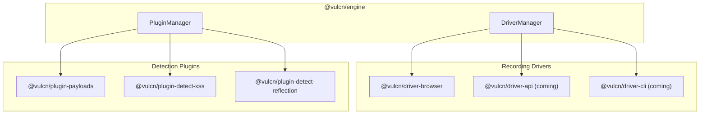

## Overview

Vulcn v0.3.0 introduces a **driver-based architecture** that makes the recording and replay system modular and extensible. Instead of being limited to web applications, Vulcn can now support multiple recording targets through drivers.



## What is a Driver?

A driver is a package that provides:

1. **RecorderDriver** - Captures interactions for a specific target type
2. **RunnerDriver** - Replays sessions with payload injection
3. **Auto-Crawl** _(optional)_ - Automatically discovers forms and injection points

Each driver defines its own step types. For example, the browser driver defines:

- `browser.navigate` - Navigate to a URL
- `browser.click` - Click an element
- `browser.input` - Type into a form field
- `browser.keypress` - Press a key

## Available Drivers

<CardGroup cols={3}>
  <Card title="Browser" icon="globe" href="/drivers/browser">
    Web application testing with Playwright
  </Card>
  <Card title="API" icon="code" href="/drivers/api">
    HTTP/REST API testing (coming soon)
  </Card>
  <Card title="CLI" icon="terminal" href="/drivers/cli">
    Command-line tool testing (coming soon)
  </Card>
</CardGroup>

## Session Format

Sessions now include a `driver` field to indicate which driver recorded them:

```yaml
name: Login Test
driver: browser
driverConfig:
  browser: chromium
  startUrl: https://example.com/login
  viewport:
    width: 1280
    height: 720
steps:
  - id: step_001
    type: browser.navigate
    url: https://example.com/login
    timestamp: 0
  - id: step_002
    type: browser.input
    selector: input[name="username"]
    value: testuser
    injectable: true
    timestamp: 1500
metadata:
  recordedAt: "2026-02-06T12:00:00Z"
```

<Note>
  Step types are namespaced (`browser.input` instead of just `input`) to avoid
  conflicts between drivers.
</Note>

## Driver API

Drivers implement two interfaces:

### RecorderDriver

```typescript
interface RecorderDriver {
  start(
    config: Record<string, unknown>,
    options: RecordOptions,
  ): Promise<RecordingHandle>;

  // Optional: auto-discover forms and generate sessions
  crawl?(
    config: Record<string, unknown>,
    options: CrawlOptions,
  ): Promise<Session[]>;
}

interface RecordingHandle {
  stop(): Promise<Session>;
  abort(): Promise<void>;
  getSteps(): Step[];
  addStep(step: Omit<Step, "id" | "timestamp">): void;
}
```

<Info>
  The `crawl()` method is optional. Only drivers that support automated form
  discovery need to implement it. Currently, only the browser driver supports
  auto-crawl.
</Info>

### RunnerDriver

```typescript
interface RunnerDriver {
  execute(session: Session, ctx: RunContext): Promise<RunResult>;
}
```

## Using Drivers

### With CLI

```bash
# Record with browser driver (default)
vulcn record https://example.com

# Specify driver explicitly
vulcn record https://example.com --driver browser

# Auto-crawl: discover forms automatically (no manual recording)
vulcn record https://example.com --auto
```

### Programmatically

```typescript
import { DriverManager, driverManager } from "@vulcn/engine";
import browserDriver from "@vulcn/driver-browser";

// Register driver
driverManager.register(browserDriver);

// Option 1: Manual recording
const handle = await driverManager.startRecording("browser", {
  startUrl: "https://example.com",
  browser: "chromium",
});

// ... user interacts ...
const session = await handle.stop();

// Option 2: Auto-crawl (discovers forms automatically)
const sessions = await driverManager.crawl(
  "browser",
  {
    startUrl: "https://example.com",
    browser: "chromium",
    headless: true,
  },
  {
    maxDepth: 2,
    maxPages: 20,
  },
);
```

## Creating Custom Drivers

See [Creating Drivers](/drivers/creating-drivers) for a complete guide on building your own driver.

<Card title="Browser Driver" icon="globe" href="/drivers/browser">
  Learn about the browser driver and its configuration options
</Card>
