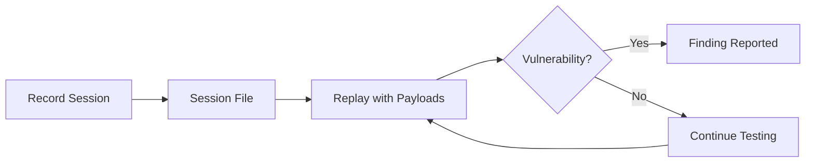

## What is Vulcn?

Vulcn is a **security testing tool** that makes it easy to find vulnerabilities in web applications. Instead of manually testing each input field with different payloads, Vulcn lets you:

1. **Record** browser interactions once (clicks, form fills, navigation)
2. **Replay** sessions with security payloads injected into inputs
3. **Detect** vulnerabilities via plugin hooks (dialogs, console, patterns)

<CardGroup cols={2}>
  <Card title="Quickstart" icon="rocket" href="/quickstart">
    Get up and running in under 5 minutes
  </Card>
  <Card title="CLI Reference" icon="terminal" href="/cli/overview">
    Explore all available commands
  </Card>
  <Card title="Plugins" icon="plug" href="/plugins/overview">
    Extend Vulcn with detection plugins
  </Card>
  <Card title="API Reference" icon="code" href="/api/overview">
    Use Vulcn programmatically
  </Card>
</CardGroup>

## Key Features

<AccordionGroup>
  <Accordion title="🎬 Session Recording" icon="video">
    Record your browser interactions and Vulcn captures them as a replayable
    session. No need to write test scripts—just use the application normally.
    ```bash vulcn record https://example.com --output session.vulcn.yml ```
  </Accordion>

  <Accordion title="💉 Payload Injection" icon="syringe">
    Vulcn automatically injects security payloads into form inputs during
    replay. Built-in payloads cover XSS, SQLi, SSRF, XXE, and more. ```bash
    vulcn run session.vulcn.yml --payload xss-basic sqli-basic ```
  </Accordion>

  <Accordion title="🔌 Plugin System" icon="plug">
    Extend Vulcn with plugins for custom detection, payload loading, and
    reporting. The hook-based architecture makes it easy to add new
    capabilities. ```yaml # vulcn.config.yml plugins: - name:
    "@vulcn/plugin-detect-xss" - name: "@vulcn/plugin-detect-reflection" ```
  </Accordion>

  <Accordion title="🎯 Execution-Based Detection" icon="bullseye">
    Unlike pattern-matching tools, Vulcn detects **actual JavaScript
    execution**—when `alert()` fires, you know the XSS is real.
  </Accordion>
</AccordionGroup>

## How It Works



<Steps>
  <Step title="Record a Session">
    Open a browser window and interact with your application. Vulcn captures
    every click, input, and navigation.
  </Step>
  <Step title="Choose Payloads">
    Select from built-in payloads (XSS, SQLi, etc.) or load custom ones from
    files or PayloadsAllTheThings.
  </Step>
  <Step title="Run Tests">
    Vulcn replays your session, injecting each payload into every input field
    and monitoring for vulnerabilities.
  </Step>
  <Step title="Review Findings">
    Get detailed reports of confirmed vulnerabilities with evidence, payloads,
    and affected URLs.
  </Step>
</Steps>

## Installation

<CodeGroup>

```bash npm
npm install -g vulcn
```

```bash pnpm
pnpm add -g vulcn
```

```bash yarn
yarn global add vulcn
```

</CodeGroup>

<Note>
  Vulcn uses Playwright for browser automation. Browsers will be installed
  automatically on first use, or you can run `vulcn install` to install them
  manually.
</Note>

## Quick Example

```bash
# Initialize configuration
vulcn init

# Record a session (opens browser)
vulcn record https://vulnerable-app.com --output session.vulcn.yml

# Run security tests
vulcn run session.vulcn.yml

# List available payloads
vulcn payloads
```

<Card title="Ready to start?" icon="rocket" href="/quickstart">
  Follow our quickstart guide to find your first vulnerability
</Card>
