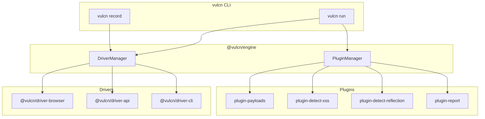

## What is Vulcn?

Vulcn is a **modern, fast penetration testing framework** designed for developers and security engineers who want to find vulnerabilities without the complexity of legacy tools. Instead of manually testing each input, Vulcn lets you:

1. **Record** interactions once (browser clicks, form submissions, navigation)
2. **Replay** sessions with security payloads injected into every input
3. **Detect** real vulnerabilities via execution-based detection (not just pattern matching)
4. **Report** findings with branded HTML dashboards, JSON for CI/CD, or YAML

<CardGroup cols={2}>
  <Card title="Quickstart" icon="rocket" href="/quickstart">
    Get up and running in under 5 minutes
  </Card>
  <Card title="CLI Reference" icon="terminal" href="/cli/overview">
    Explore all available commands
  </Card>
  <Card title="Drivers" icon="car" href="/drivers/overview">
    Browser, API, and CLI recording
  </Card>
  <Card title="Plugins" icon="plug" href="/plugins/overview">
    Detection, payloads, and reporting plugins
  </Card>
</CardGroup>

## Why Vulcn?

<CardGroup cols={3}>
  <Card title="⚡ Fast" icon="bolt">
    Lightweight CLI that starts in milliseconds. No JVM, no desktop app, no
    proxy setup—just `npm install -g vulcn` and go.
  </Card>
  <Card title="🔌 Pluggable" icon="plug">
    Modular driver and plugin architecture. Add detection, payloads, and
    reporting as you need them. Nothing bloated, nothing monolithic.
  </Card>
  <Card title="🎯 Accurate" icon="bullseye">
    Execution-based detection verifies real JavaScript execution—when `alert()`
    fires, you know the XSS is confirmed, not just a guess.
  </Card>
</CardGroup>

## Architecture

Vulcn v0.3.0 uses a modular architecture with **drivers** for different targets and **plugins** for detection and reporting:



## Key Features

<AccordionGroup>
  <Accordion title="🚗 Driver System" icon="car">
    Modular drivers for different recording targets. Browser driver included, with API and CLI drivers coming soon.
    ```bash
    # Record web application
    vulcn record https://example.com --driver browser
    
    # Future: Record API calls
    vulcn record https://api.example.com --driver api
    ```
  </Accordion>

<Accordion title="💉 Payload Injection" icon="syringe">
  Automatically injects security payloads into injectable fields during replay.
  Payloads are fetched from PayloadsAllTheThings on demand. Use short aliases
  for quick access to common types. ```bash vulcn run session.vulcn.yml -p xss
  sqli cmd ```
</Accordion>

<Accordion title="🔌 Plugin System" icon="plug">
  Extend Vulcn with plugins for custom detection, payload loading, and
  reporting. Hook-based architecture for easy customization. ```yaml #
  vulcn.config.yml plugins: - name: "@vulcn/plugin-detect-xss" - name:
  "@vulcn/plugin-detect-reflection" - name: "@vulcn/plugin-report" ```
</Accordion>

<Accordion title="🎯 Execution-Based Detection" icon="bullseye">
  Unlike pattern-matching tools, Vulcn detects **actual JavaScript
  execution**—when `alert()` fires, you know the XSS is real. No false positives
  from reflected strings that never execute.
</Accordion>

  <Accordion title="📊 Security Reports" icon="chart-bar">
    Generate professional security reports in multiple formats. HTML reports feature a modern dark-themed dashboard with risk gauges and severity breakdowns. JSON output integrates directly into CI/CD pipelines.
    ```bash
    # Generate HTML report (auto-opens in browser)
    vulcn run session.vulcn.yml --report html
    
    # Generate JSON for CI/CD
    vulcn run session.vulcn.yml --report json
    
    # Generate all formats
    vulcn run session.vulcn.yml --report all
    ```
  </Accordion>
</AccordionGroup>

## How It Works

<Steps>
  <Step title="Record a Session">
    Choose a driver (browser, api, cli) and record your interactions. Vulcn
    captures every action as a replayable session.
  </Step>
  <Step title="Choose Payloads">
    Select from community-curated payload types (xss, sqli, xxe, cmd, redirect,
    traversal), or load custom ones from files.
  </Step>
  <Step title="Run Tests">
    Vulcn replays your session, injecting each payload into every input field
    and monitoring for vulnerabilities via execution-based detection.
  </Step>
  <Step title="Review Reports">
    Get detailed HTML dashboards, JSON for CI/CD pipelines, or YAML reports—with
    risk scores, severity breakdowns, and evidence for every finding.
  </Step>
</Steps>

## Installation

<CodeGroup>

```bash npm
npm install -g vulcn
```

```bash pnpm
pnpm add -g vulcn
```

```bash yarn
yarn global add vulcn
```

</CodeGroup>

<Note>
  Vulcn uses Playwright for browser automation. Browsers are installed
  automatically on first use. Run `vulcn doctor` to check your setup.
</Note>

## Quick Example

```bash
# Initialize configuration
vulcn init

# Record a session (opens browser)
vulcn record https://vulnerable-app.com --output session.vulcn.yml

# Run security tests
vulcn run session.vulcn.yml

# Run with multiple payload types and generate a report
vulcn run session.vulcn.yml -p xss sqli -r html

# List available payload types
vulcn payloads
```

## Packages

| Package                           | Description                                       |
| --------------------------------- | ------------------------------------------------- |
| `vulcn`                           | CLI tool — record, crawl, run, and manage plugins |
| `@vulcn/engine`                   | Core engine with driver & plugin systems          |
| `@vulcn/driver-browser`           | Playwright-based browser recording & replay       |
| `@vulcn/plugin-payloads`          | Payload loading from PayloadsAllTheThings         |
| `@vulcn/plugin-detect-xss`        | Execution-based XSS detection                     |
| `@vulcn/plugin-detect-sqli`       | SQL injection detection (error, timing, diff)     |
| `@vulcn/plugin-detect-reflection` | Input reflection & output encoding detection      |
| `@vulcn/plugin-report`            | HTML, JSON, and YAML security report generation   |

<Card title="Ready to start?" icon="rocket" href="/quickstart">
  Follow our quickstart guide to find your first vulnerability
</Card>
