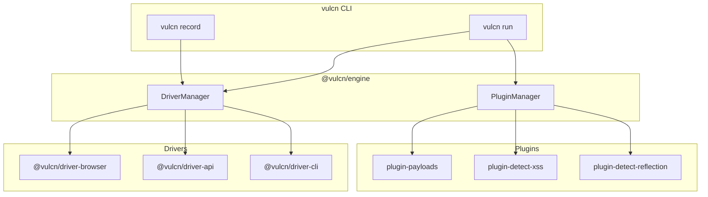

## What is Vulcn?

Vulcn is a **driver-based security testing framework** that makes it easy to find vulnerabilities in applications. Instead of manually testing each input with different payloads, Vulcn lets you:

1. **Record** interactions once (browser clicks, API requests, CLI commands)
2. **Replay** sessions with security payloads injected into inputs
3. **Detect** vulnerabilities via plugins (XSS, SQLi, reflection, etc.)

<CardGroup cols={2}>
  <Card title="Quickstart" icon="rocket" href="/quickstart">
    Get up and running in under 5 minutes
  </Card>
  <Card title="CLI Reference" icon="terminal" href="/cli/overview">
    Explore all available commands
  </Card>
  <Card title="Drivers" icon="car" href="/drivers/overview">
    Browser, API, and CLI recording
  </Card>
  <Card title="Plugins" icon="plug" href="/plugins/overview">
    Extend Vulcn with detection plugins
  </Card>
</CardGroup>

## Architecture

Vulcn v0.3.0 introduces a modular architecture with **drivers** for different targets and **plugins** for detection:



## Key Features

<AccordionGroup>
  <Accordion title="🚗 Driver System" icon="car">
    Modular drivers for different recording targets. Browser driver included, with API and CLI drivers coming soon.
    ```bash
    # Record web application
    vulcn record https://example.com --driver browser
    
    # Future: Record API calls
    vulcn record https://api.example.com --driver api
    ```
  </Accordion>

<Accordion title="💉 Payload Injection" icon="syringe">
  Automatically injects security payloads into injectable fields during replay.
  Built-in payloads cover XSS, SQLi, SSRF, XXE, and more. ```bash vulcn run
  session.vulcn.yml --payload xss-basic sqli-basic ```
</Accordion>

<Accordion title="🔌 Plugin System" icon="plug">
  Extend Vulcn with plugins for custom detection, payload loading, and
  reporting. Hook-based architecture for easy customization. ```yaml #
  vulcn.config.yml plugins: - name: "@vulcn/plugin-detect-xss" - name:
  "@vulcn/plugin-detect-reflection" ```
</Accordion>

  <Accordion title="🎯 Execution-Based Detection" icon="bullseye">
    Unlike pattern-matching tools, Vulcn detects **actual JavaScript execution**—when `alert()` fires, you know the XSS is real.
  </Accordion>
</AccordionGroup>

## How It Works

<Steps>
  <Step title="Record a Session">
    Choose a driver (browser, api, cli) and record your interactions. Vulcn
    captures every action as a replayable session.
  </Step>
  <Step title="Choose Payloads">
    Select from built-in payloads (XSS, SQLi, etc.) or load custom ones from
    files or PayloadsAllTheThings.
  </Step>
  <Step title="Run Tests">
    Vulcn replays your session, injecting each payload into every input field
    and monitoring for vulnerabilities.
  </Step>
  <Step title="Review Findings">
    Get detailed reports of confirmed vulnerabilities with evidence, payloads,
    and affected URLs.
  </Step>
</Steps>

## Installation

<CodeGroup>

```bash npm
npm install -g vulcn
```

```bash pnpm
pnpm add -g vulcn
```

```bash yarn
yarn global add vulcn
```

</CodeGroup>

<Note>
  Vulcn uses Playwright for browser automation. System Chrome/Edge is used by
  default. Run `vulcn doctor` to check browser availability.
</Note>

## Quick Example

```bash
# Initialize configuration
vulcn init

# Record a session (opens browser)
vulcn record https://vulnerable-app.com --output session.vulcn.yml

# Run security tests
vulcn run session.vulcn.yml

# List available payloads
vulcn payloads
```

## Packages

| Package                           | Description                              |
| --------------------------------- | ---------------------------------------- |
| `vulcn`                           | CLI tool                                 |
| `@vulcn/engine`                   | Core engine with driver & plugin systems |
| `@vulcn/driver-browser`           | Browser recording with Playwright        |
| `@vulcn/plugin-payloads`          | XSS, SQLi, SSRF payloads                 |
| `@vulcn/plugin-detect-xss`        | Execution-based XSS detection            |
| `@vulcn/plugin-detect-reflection` | Pattern-based reflection detection       |

<Card title="Ready to start?" icon="rocket" href="/quickstart">
  Follow our quickstart guide to find your first vulnerability
</Card>
