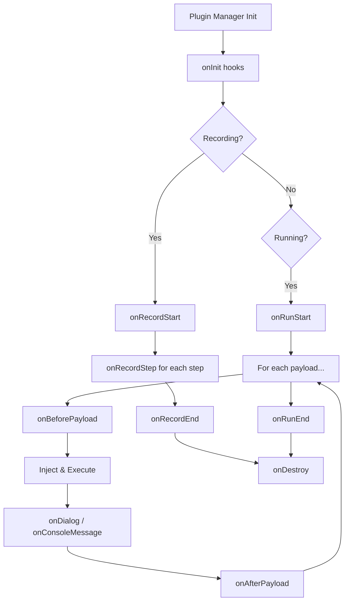

## Overview

Vulcn's plugin system allows you to extend its capabilities with custom detection logic, payload sources, and reporting formats. The architecture is based on **hooks**—lifecycle events that plugins can listen to and respond to.

```
┌──────────────────────────────────────────────────────────────────────┐
│                          @vulcn/engine                                │
│  ┌─────────────┐  ┌─────────────┐  ┌──────────────────────────────┐  │
│  │   Recorder  │  │   Runner    │  │       Plugin Manager         │  │
│  │  (capture)  │  │  (replay)   │  │  ┌──────┐ ┌──────┐ ┌──────┐  │  │
│  └─────────────┘  └─────────────┘  │  │  P1  │ │  P2  │ │  P3  │  │  │
│                                     │  └──────┘ └──────┘ └──────┘  │  │
│        ▲               ▲           └──────────────────────────────┘  │
│        │               │                        ▲                     │
│        └───────────────┴────────────────────────┘                     │
│                    Plugin Hooks                                       │
└──────────────────────────────────────────────────────────────────────┘
```

## Plugin Types

| Type             | Purpose                   | Example                    |
| ---------------- | ------------------------- | -------------------------- |
| **Loaders**      | Provide payloads          | `@vulcn/plugin-payloads`   |
| **Detectors**    | Find vulnerabilities      | `@vulcn/plugin-detect-xss` |
| **Reporters**    | Generate security reports | `@vulcn/plugin-report`     |
| **Transformers** | Modify sessions/payloads  | Custom preprocessing       |

## Official Plugins

<CardGroup cols={2}>
  <Card
    title="@vulcn/plugin-payloads"
    icon="syringe"
    href="/plugins/plugin-payloads"
  >
    Load built-in, PayloadBox, and custom payloads
  </Card>
  <Card
    title="@vulcn/plugin-detect-xss"
    icon="bug"
    href="/plugins/plugin-detect-xss"
  >
    Execution-based XSS detection
  </Card>
  <Card
    title="@vulcn/plugin-detect-reflection"
    icon="magnifying-glass"
    href="/plugins/plugin-detect-reflection"
  >
    Input reflection & output encoding detection
  </Card>
  <Card
    title="@vulcn/plugin-report"
    icon="chart-bar"
    href="/plugins/plugin-report"
  >
    HTML, JSON, and YAML security reports
  </Card>
</CardGroup>

## Configuration

Plugins are configured in `vulcn.config.yml`:

```yaml
plugins:
  - name: "@vulcn/plugin-payloads"
    config:
      builtin: true

  - name: "@vulcn/plugin-detect-xss"
    config:
      detectDialogs: true
      severity: high
```

## Managing Plugins

Use the CLI to manage plugins:

```bash
# List configured plugins
vulcn plugin list

# Add a plugin
vulcn plugin add @vulcn/plugin-detect-reflection

# Remove a plugin
vulcn plugin remove @vulcn/plugin-detect-reflection

# Enable/disable
vulcn plugin enable @vulcn/plugin-detect-xss
vulcn plugin disable @vulcn/plugin-detect-xss
```

## Default Plugins

When you run `vulcn run` without a config file, the CLI automatically loads:

1. **Payloads**: Loads `xss-basic` built-in payload set
2. **Detection**: Loads `@vulcn/plugin-detect-xss` for XSS detection

This ensures Vulcn is useful out of the box.

## Plugin Lifecycle



## Creating Plugins

<Card
  title="Creating Custom Plugins"
  icon="hammer"
  href="/plugins/creating-plugins"
>
  Learn how to build your own Vulcn plugins
</Card>
