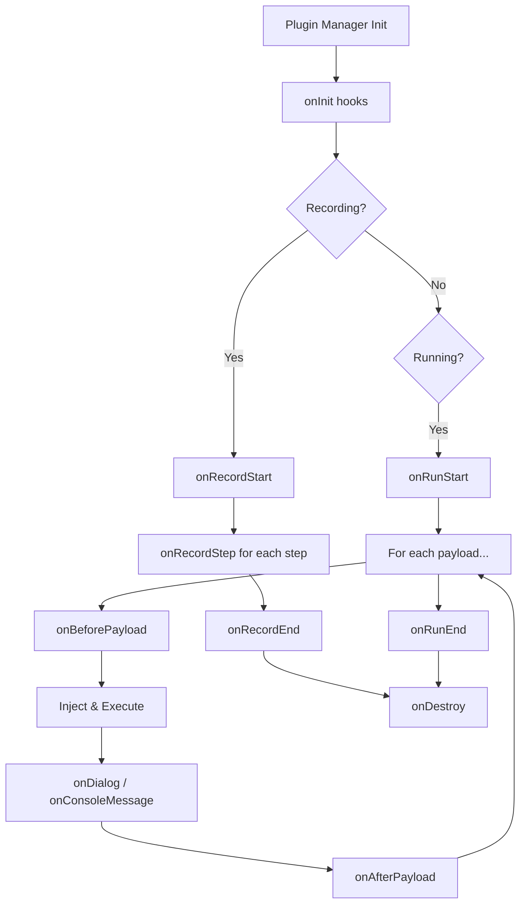

## Overview

Vulcn's plugin system allows you to extend its capabilities with custom detection logic, payload sources, and reporting formats. The architecture is based on **hooks**—lifecycle events that plugins can listen to and respond to.

```
┌──────────────────────────────────────────────────────────────────────┐
│                          @vulcn/engine                                │
│  ┌─────────────┐  ┌─────────────┐  ┌──────────────────────────────┐  │
│  │   Recorder  │  │   Runner    │  │       Plugin Manager         │  │
│  │  (capture)  │  │  (replay)   │  │  ┌──────┐ ┌──────┐ ┌──────┐  │  │
│  └─────────────┘  └─────────────┘  │  │  P1  │ │  P2  │ │  P3  │  │  │
│                                     │  └──────┘ └──────┘ └──────┘  │  │
│        ▲               ▲           └──────────────────────────────┘  │
│        │               │                        ▲                     │
│        └───────────────┴────────────────────────┘                     │
│                    Plugin Hooks                                       │
└──────────────────────────────────────────────────────────────────────┘
```

## Plugin Types

| Type             | Purpose                   | Example                    |
| ---------------- | ------------------------- | -------------------------- |
| **Loaders**      | Provide payloads          | `@vulcn/plugin-payloads`   |
| **Detectors**    | Find vulnerabilities      | `@vulcn/plugin-detect-xss` |
| **Reporters**    | Generate security reports | `@vulcn/plugin-report`     |
| **Transformers** | Modify sessions/payloads  | Custom preprocessing       |

## Official Plugins

<CardGroup cols={2}>
  <Card
    title="@vulcn/plugin-payloads"
    icon="syringe"
    href="/plugins/plugin-payloads"
  >
    Load payloads from PayloadsAllTheThings and custom files
  </Card>
  <Card
    title="@vulcn/plugin-detect-xss"
    icon="bug"
    href="/plugins/plugin-detect-xss"
  >
    Execution-based XSS detection
  </Card>
  <Card
    title="@vulcn/plugin-detect-sqli"
    icon="database"
    href="/plugins/plugin-detect-sqli"
  >
    SQL injection detection via error patterns, timing, and response diffing
  </Card>
  <Card
    title="@vulcn/plugin-detect-reflection"
    icon="magnifying-glass"
    href="/plugins/plugin-detect-reflection"
  >
    Input reflection & output encoding detection
  </Card>
  <Card
    title="@vulcn/plugin-passive"
    icon="shield-halved"
    href="/plugins/plugin-passive"
  >
    Passive scanner — security headers, cookies, info disclosure, CORS
  </Card>
  <Card
    title="@vulcn/plugin-report"
    icon="chart-bar"
    href="/plugins/plugin-report"
  >
    HTML, JSON, YAML, and SARIF security reports
  </Card>
</CardGroup>

## Configuration

Plugins are configured automatically via flat keys in `.vulcn.yml` — no plugin array or manual management needed:

```yaml
# .vulcn.yml
payloads:
  types:
    - xss
    - sqli

detection:
  xss:
    dialogs: true
    severity: high
  reflection:
    enabled: true
  passive: true

report:
  format: html
```

The engine maps these flat config keys to the correct internal plugins. See [How Plugins Work](/config/plugins) for the full mapping table.

## Auto-Loading

When you run `vulcn run`, the `PluginManager` automatically loads plugins based on your `.vulcn.yml`:

1. **`@vulcn/plugin-payloads`** — Always loaded, config from `payloads.*`
2. **`@vulcn/plugin-detect-xss`** — Always loaded, config from `detection.xss.*`
3. **`@vulcn/plugin-detect-sqli`** — Auto-loaded when `sqli` is in `payloads.types`
4. **`@vulcn/plugin-detect-reflection`** — Loaded when `detection.reflection.enabled` is true
5. **`@vulcn/plugin-passive`** — Loaded when `detection.passive` is true
6. **`@vulcn/plugin-report`** — Loaded when `report.format` is set

This ensures Vulcn is useful out of the box with zero configuration.

## Plugin Lifecycle



## Creating Plugins

<Card
  title="Creating Custom Plugins"
  icon="hammer"
  href="/plugins/creating-plugins"
>
  Learn how to build your own Vulcn plugins
</Card>
